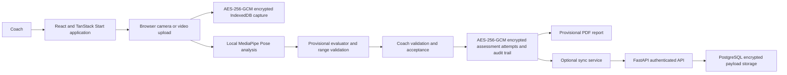

# AI Athlete 360 Insights

AI Athlete 360 Insights is a local-first, coach-reviewed athlete assessment prototype. It supports a ten-test fitness battery, encrypted device storage, browser-based video capture or upload, local pose analysis, provisional AI estimates, coach validation, downloadable PDF reports, and optional encrypted API synchronization.

The application is deliberately designed to distinguish an observed AI estimate from an official assessment result. A coach must review every captured result before it becomes accepted, and unusable videos require a retake instead of receiving a fabricated score.

## Contents

- [What the prototype does](#what-the-prototype-does)
- [Assessment battery](#assessment-battery)
- [Assessment workflow](#assessment-workflow)
- [AI measurement and validation](#ai-measurement-and-validation)
- [Architecture](#architecture)
- [Local data, privacy, and security](#local-data-privacy-and-security)
- [Frontend setup](#frontend-setup)
- [Backend API setup](#backend-api-setup)
- [Vercel deployment](#vercel-deployment)
- [API reference](#api-reference)
- [Testing and build](#testing-and-build)
- [Demo-video evidence](#demo-video-evidence)
- [PWA and native status](#pwa-and-native-status)
- [Production readiness boundaries](#production-readiness-boundaries)
- [Repository map](#repository-map)

## What the prototype does

- Registers athletes and maintains their assessment history.
- Runs a configurable battery of ten fitness-test workflows.
- Captures a new video in the browser or accepts an uploaded video for movement tests.
- Runs MediaPipe Pose Landmarker Lite locally in the browser to inspect pose visibility, framing, and movement evidence.
- Produces a provisional movement-based estimate for each supported video workflow when analysis is usable.
- Range-checks estimates, derives a provisional range-normalized score, and flags out-of-range results for coach intervention.
- Accepts calibrated manual Height and Weight entries with allowed-range validation.
- Requires coach validation and acceptance before an attempt is treated as completed.
- Stores athlete profiles, captures, attempts, and audit events in encrypted IndexedDB.
- Generates provisional PDF reports from the accepted assessment data.
- Optionally synchronizes athletes and assessment attempts to a secure FastAPI service when an API origin is configured.

## Assessment battery

All records are provisional. The measurement ranges below are plausibility and workflow-validation bounds; they are not sport-, age-, sex-, or federation-specific performance benchmarks.

| Test | Method | Output | Configured allowed range | Current result source |
| --- | --- | --- | --- | --- |
| Height | Manual | cm | 80-230 cm | Coach entry from a calibrated device |
| Weight | Manual | kg | 15-200 kg | Coach entry from a calibrated scale |
| Sit & Reach | Video | cm | 0-50 cm | Provisional wrist-travel pose estimate |
| Standing Vertical Jump | Video | cm | 5-120 cm | Provisional vertical-displacement pose estimate |
| Standing Broad Jump | Video | m | 0.5-4.0 m | Provisional horizontal-displacement pose estimate |
| Medicine Ball Throw | Video | m | 1.0-25.0 m | Provisional wrist-trajectory pose estimate |
| 30m Sprint | Video + coach timing | s | 3.5-15.0 s | Coach-confirmed time; AI waits for verified line/timing evidence |
| 4x10m Shuttle Run | Video + coach timing | s | 7.5-35.0 s | Coach-confirmed time; AI waits for verified turn-line/timing evidence |
| Sit-Ups | Video + coach count | reps | 0-60 reps | 30s under 12; 45s age 12+; coach confirmation required |
| Endurance Run | Video + coach timing | min | 1.5-15.0 min | 800m under 12; 1.6km age 12+; coach confirmation required |

### Capture guidance

For video workflows, place the device on a stable surface approximately three metres from the athlete. Use adequate light, a plain background, and keep one athlete fully visible throughout the movement. Built-in recordings use browser-supported WebM and flush media chunks before saving to improve decode reliability.

Seven sample videos are included under [sample_video](sample_video), including Sit & Reach, Vertical Jump, Broad Jump, Medicine Ball Throw, Sprint, Shuttle, and Sit-Ups. Use the four pose-estimated tests for the automated demo: Sit & Reach, Vertical Jump, Broad Jump, and Medicine Ball Throw.

## Assessment workflow

1. A coach signs in or starts the offline prototype session and selects an athlete.
2. The coach chooses a test from the battery.
3. For Height and Weight, the coach records a value from a calibrated measurement device.
4. For movement tests, the coach uploads a video or records one in the browser.
5. The application encrypts and saves the capture locally, then samples frames with MediaPipe Pose.
6. Pose quality is checked using detected frames, landmark visibility, and body-in-frame rate.
7. For Sit & Reach, Vertical Jump, Broad Jump, and Medicine Ball Throw, a usable timeline is converted into a provisional test-specific metric and range-normalized score.
8. Timed-course and age-dependent protocols retain the pose-quality evidence but require the coach to enter the approved time or count.
9. The result remains in `awaiting coach review`; the coach may confirm or replace the metric and assign the final provisional rating and score.
10. The coach accepts the validated attempt or requests a retest.
11. Dashboards, history, summary, synchronization, and PDF reports use the persisted attempt state.

### Capture outcomes

| Outcome | Meaning | Next action |
| --- | --- | --- |
| Usable provisional estimate | Pose quality and a test-specific movement signal were available. | Coach reviews, validates, and accepts or requests a retest. |
| Out-of-range provisional estimate | A movement signal was available, but the result fell outside the configured allowed range. | Coach intervention is required before the result can be used. |
| Invalid capture | The file is not a usable video, is too short, cannot be decoded, or fails pose-quality requirements. | Retake the video. No score is fabricated. |
| Saved retryable capture | A saved, unaccepted capture has no usable AI metric. | Use **Run AI Analysis Again** after correcting the analysis environment or capture conditions. |

Accepted or rejected attempts cannot be silently reanalyzed. This preserves the audit trail and prevents an accepted coach decision from being overwritten by a later automated run.

## AI measurement and validation

### What is implemented

MediaPipe Pose Landmarker Lite runs in the client using local model and WASM assets. The analyzer samples video frames and records compact evidence including:

- Number of analyzed and detected frames
- Mean landmark visibility
- Body-in-frame rate
- Observed movement duration
- Normalized horizontal and vertical displacement/travel
- Wrist travel
- Optional torso movement cycles

The estimator maps evidence to a test-specific provisional value only for Sit & Reach, Standing Vertical Jump, Standing Broad Jump, and Medicine Ball Throw. These movement tests use body-height-normalized pose signals, with athlete height used as an optional reference where appropriate. Timed-course, age-dependent, and anthropometric tests require coach-confirmed protocol measurements because ordinary pose video cannot verify course markings, official timing, or the required test duration.

Each supported estimate is rounded to the test entry step, compared with the configured minimum and maximum, and assigned a provisional score from `15` to `100` when in range. A result outside the allowed range remains visible but receives score `0` and requires coach intervention.

## Demo video evidence

The product supports the offline assessment and synchronization workflow required for a demonstration: the service worker caches the application shell and local MediaPipe assets after the first connected load; athlete profiles, captures, assessments, and audit events remain AES-GCM encrypted in IndexedDB; and synchronization is retried automatically when the device returns online. The full recording plan, required spoken/caption text, sample files, and export checklist are in [docs/demo-video-script.md](docs/demo-video-script.md).

### Height and Weight

Height and Weight do not use a generic video estimate. The app requires a coach-entered value from a calibrated stadiometer, scale, or other approved device. A valid entry shows an `Allowed-range validation` score of `100`; this confirms that the value is plausible within the configured range, not that it is an athletic-performance benchmark.

### Important limitations

- Pose-derived distances, counts, and durations are not calibrated official measurements.
- The app does not currently use reference rulers, court/track markers, timing gates, ball tracking, GPS, or dense frame-by-frame repetition classification.
- The range-normalized score is provisional and must not be treated as a clinical result, injury-risk prediction, talent-selection decision, or official benchmark.
- A pose model cannot safely infer Height or Weight from ordinary video without a validated calibration protocol.
- Coaches remain responsible for applying the approved assessment protocol and assigning the final accepted value, score, and rating.

## Architecture



### Frontend

- React 19 and TypeScript
- TanStack Router and TanStack Start / Nitro SSR build
- Vite 8
- Tailwind CSS and Radix UI primitives
- Dexie for IndexedDB access
- Web Crypto AES-256-GCM for local encrypted records
- MediaPipe Tasks Vision Pose Landmarker Lite for in-browser pose analysis
- jsPDF for downloadable provisional reports
- Vitest for unit and workflow tests

### Backend

The optional service in [backend](backend) uses FastAPI, SQLAlchemy, Alembic, PostgreSQL, Argon2id password hashes, JWT bearer authentication, and Fernet-encrypted payload storage. The browser can run without it for offline prototype work.

The sync order is intentionally dependency-aware: pending athlete profiles synchronize before dependent assessment attempts. Local UUIDs and versions support idempotent writes and conflict detection. Video blobs stay encrypted on the device and are not uploaded by the current API.

## Local data, privacy, and security

### Local persistence

The browser stores the following records separately in IndexedDB:

- Athlete profiles
- Video-capture metadata and encrypted blobs
- Assessment attempts and evaluations
- Audit events
- Sync state and optimistic-concurrency versions

Payloads are encrypted with AES-256-GCM through the Web Crypto API before they are persisted. This is local-at-rest protection, not a replacement for operating-system, device, browser-profile, or institutional security controls.

### Authentication and authorization

Without `VITE_ASSESSMENT_API_URL`, login is an intentionally local prototype coach session for offline UI development. With an API origin configured, coaches can use verified email/password registration, a verification link, mobile OTP, Google OAuth, or an approved government SSO provider. The client retains the short-lived bearer token only in `sessionStorage`. A `401` clears the session and returns the user to the login screen.

Email links and SMS OTP are disabled until their delivery provider is configured. Google and government SSO buttons lead to a clear configuration error until their client credentials and approved callback URLs are set; they are not local fallbacks.

Client-side role checks improve the user experience but are not a security boundary. The backend independently enforces authenticated permissions and owner-scoped athlete/assessment access.

### API security measures

- Argon2id password hashing
- JWT bearer tokens
- Encrypted persisted athlete and assessment payloads using a deployment-provided Fernet key
- Restricted CORS and trusted-host configuration
- HTTPS redirect and HSTS in production
- `Cache-Control: no-store`, `X-Content-Type-Options`, and `Referrer-Policy` response headers
- Request correlation IDs
- Idempotency keys and version-conflict handling
- Immutable assessment audit events

## Frontend setup

### Prerequisites

- Node.js 20 or later
- npm 10 or later
- A modern browser with camera permission for browser recording

### Install and run

```sh
git clone https://github.com/ananyhanu/AI_Athlete_360_Insights.git
cd AI_Athlete_360_Insights
npm install
npm run dev
```

The `predev` script copies the MediaPipe model and WASM assets into `public/mediapipe` and `public/models`. Open the local URL Vite prints, normally `http://localhost:3000` or the next available port.

### Optional frontend environment

Create a local environment file only when connecting to the backend:

```sh
VITE_ASSESSMENT_API_URL=http://localhost:8080
```

Use an absolute HTTPS URL outside local development, for example:

```sh
VITE_ASSESSMENT_API_URL=https://assessments.example.in
```

Do not commit environment files containing deployment values or secrets.

## Backend API setup

### Prerequisites

- Python 3.12 or later
- PostgreSQL for production-like use
- A virtual environment

### Configure and start

```sh
cd backend
python -m venv .venv
.venv\Scripts\activate
pip install -r requirements.txt
copy .env.example .env
alembic upgrade head
python -m app.bootstrap
uvicorn app.main:app --host 0.0.0.0 --port 8080 --proxy-headers
```

On macOS or Linux, activate the environment with:

```sh
source .venv/bin/activate
```

Configure `backend/.env` from [backend/.env.example](backend/.env.example). The required settings are:

| Variable | Purpose |
| --- | --- |
| `AA360_ENVIRONMENT` | `production` enables production-only HTTPS behavior. |
| `AA360_DATABASE_URL` | PostgreSQL SQLAlchemy connection URL. |
| `AA360_JWT_SECRET` | At least a 32-character JWT signing secret from a secret manager. |
| `AA360_DATA_ENCRYPTION_KEY` | Fernet payload-encryption key from a KMS or secret manager. |
| `AA360_CORS_ORIGINS` | Comma-separated allowed application origins. |
| `AA360_TRUSTED_HOSTS` | Comma-separated accepted API hosts. |
| `AA360_API_PUBLIC_URL` | Public API origin used to generate verification and SSO callback URLs. |
| `AA360_APP_PUBLIC_URL` | Public frontend origin that receives the completed SSO session. |
| `AA360_EMAIL_DELIVERY_MODE` | `console` for local development or `smtp` for real email links. |
| `AA360_MOBILE_OTP_DELIVERY_MODE` | `console` for local development or `twilio` for real SMS OTP delivery. |
| `AA360_GOOGLE_CLIENT_ID` / `AA360_GOOGLE_CLIENT_SECRET` | Google OAuth web-client credentials. |
| `AA360_GOVERNMENT_SSO_*` | Approved government identity-provider authorization, token, userinfo, client, and scope settings. |

### Verified coach identity configuration

For local testing, set `AA360_EMAIL_DELIVERY_MODE=console` and `AA360_MOBILE_OTP_DELIVERY_MODE=console`. The server prints one-time email links and OTPs only to its console; do not use console delivery in production.

For Google, register `${AA360_API_PUBLIC_URL}/v1/auth/google/callback` as an authorized redirect URI in the Google Cloud OAuth client. For government SSO, obtain the approved authorization, token, and userinfo URLs from the government identity team and register `${AA360_API_PUBLIC_URL}/v1/auth/government/callback`. The provider must return a verified email claim (`email_verified: true`) from its userinfo endpoint. Keep all client secrets in the deployment secret manager, never in the frontend or repository.

The Docker image applies Alembic migrations before starting Uvicorn. For an API health check, call `GET /healthz`; a healthy response is `{ "status": "ok" }`.

## Vercel deployment

Vercel deploys the React frontend only. It cannot use a local `http://127.0.0.1:8000` API or the SQLite file on a visitor's device. Deploy the [backend](backend) Docker service to a container platform with persistent PostgreSQL, such as Render, Railway, Fly.io, or a managed container service, before deploying the frontend.

### Render Blueprint

The included [render.yaml](render.yaml) provisions the FastAPI service and a managed PostgreSQL database. In Render, choose **New** > **Blueprint**, connect this repository, select the `pre-prod` branch, and approve the proposed resources. Render asks for values marked as `sync: false`; supply the following after it assigns the API URL:

```text
AA360_DATA_ENCRYPTION_KEY=<Fernet key generated below>
AA360_CORS_ORIGINS=https://YOUR-VERCEL-PROJECT.vercel.app
AA360_TRUSTED_HOSTS=YOUR-RENDER-API.onrender.com
AA360_API_PUBLIC_URL=https://YOUR-RENDER-API.onrender.com
AA360_APP_PUBLIC_URL=https://YOUR-VERCEL-PROJECT.vercel.app
AA360_EMAIL_DELIVERY_MODE=smtp
AA360_MOBILE_OTP_DELIVERY_MODE=twilio
```

Generate the Fernet value locally and paste its output only into Render's secret field:

```sh
python -c "from cryptography.fernet import Fernet; print(Fernet.generate_key().decode())"
```

Set the SMTP and Twilio credential variables from [backend/.env.example](backend/.env.example) in Render as well. Do not add secrets to GitHub or Vercel.

### Connect Vercel

1. Deploy the `backend` directory with its Dockerfile and provision PostgreSQL. Configure the backend service with the production values from [backend/.env.example](backend/.env.example), including `AA360_DATABASE_URL`, `AA360_JWT_SECRET`, and `AA360_DATA_ENCRYPTION_KEY`.
2. Set `AA360_API_PUBLIC_URL` to the public HTTPS API URL, `AA360_APP_PUBLIC_URL` to the Vercel URL, `AA360_CORS_ORIGINS` to the Vercel URL, and `AA360_TRUSTED_HOSTS` to the API host. Confirm `https://your-api.example.com/healthz` returns `{ "status": "ok" }`.
3. In Vercel, open the frontend project **Settings** > **Environment Variables** and add the Production variable below. Use the API origin only, with no `/v1` suffix:

	```text
	VITE_ASSESSMENT_API_URL=https://your-api.example.com
	```

4. Redeploy the Vercel frontend. `VITE_*` values are embedded at build time, so adding or changing this setting does not update an existing deployment until it is rebuilt.

For real verification messages, configure SMTP and Twilio variables on the backend service. Console delivery is local-development-only and cannot send email or SMS from a deployed Vercel frontend.

## API reference

All protected endpoints require a bearer token and enforce permissions on the server. State-changing requests use `Idempotency-Key`; updates also use `If-Match` for the expected version where applicable.

| Method | Endpoint | Purpose |
| --- | --- | --- |
| `GET` | `/healthz` | Service health check. |
| `POST` | `/v1/auth/token` | Password sign-in and token issuance. |
| `POST` | `/v1/auth/signup` | Create an unverified coach account and send an email verification link. |
| `GET` | `/v1/auth/verify-email` | Consume a one-time email verification token. |
| `POST` | `/v1/auth/mobile-otp` | Send a mobile OTP for a matching pending account. |
| `POST` | `/v1/auth/mobile-otp/verify` | Verify a mobile OTP and issue a coach session. |
| `GET` | `/v1/auth/google/start` | Begin configured Google OAuth sign-in. |
| `GET` | `/v1/auth/government/start` | Begin configured government SSO sign-in. |
| `GET` | `/v1/auth/me` | Return the authenticated coach identity. |
| `POST` | `/v1/athletes` | Create an owner-scoped athlete record. |
| `GET` | `/v1/athletes` | List athletes owned by or assigned to the authenticated coach. |
| `GET` | `/v1/athletes/{athlete_id}` | Read one authorized athlete record. |
| `PATCH` | `/v1/athletes/{athlete_id}` | Update an athlete with optimistic concurrency. |
| `PUT` | `/v1/athletes/{athlete_id}/sync` | Idempotently synchronize a local athlete record. |
| `POST` | `/v1/assessment-attempts` | Create or idempotently upsert an assessment attempt. |
| `GET` | `/v1/athletes/{athlete_id}/assessment-attempts` | List authorized attempts for an athlete. |

Example sign-in request:

```sh
curl -X POST http://localhost:8080/v1/auth/token \
	-H "Content-Type: application/json" \
	-d '{"email":"coach@example.in","password":"replace-with-your-password"}'
```

Error responses use a stable envelope such as:

```json
{
	"code": "validation_failed",
	"message": "Request validation failed."
}
```

## Testing and build

Run the frontend suite and production build before publishing a change:

```sh
npm test
npm run build
```

Focused examples:

```sh
npm test -- --run src/lib/ai-measurement.test.ts
npm test -- --run src/lib/provisional-evaluator.test.ts
./node_modules/.bin/tsc.cmd --noEmit
```

On Windows, use `./node_modules/.bin/tsc.cmd --noEmit`; on macOS or Linux, use `./node_modules/.bin/tsc --noEmit`.

The frontend test suite covers encrypted persistence, authentication/session behavior, coach scoring, battery configuration, pose-motion summaries, provisional evaluation, range validation, reporting, local workflow, and synchronization services. Backend API tests live in [backend/tests](backend/tests).

## PWA and native status

The application is installable as a Progressive Web App when served over HTTPS, or on `localhost` during development.

- Android: open the hosted app in Chrome and choose **Install app**.
- iOS: open the hosted app in Safari, choose **Share**, then **Add to Home Screen**.

The PWA includes a web manifest, Android and Apple icons, safe-area support, and a service worker that caches public shell assets. Athlete routes and API responses are intentionally excluded from the public cache.

This repository builds an SSR/Nitro bundle. `.output/public` does not contain a root `index.html`, so it is not a valid Capacitor `webDir`. Do not create Android or iOS Capacitor projects from this output. A separately tested static mobile build with an offline route entry point is required first; iOS signing and final archive creation additionally require macOS, Xcode, and an Apple Developer signing setup.

## Production readiness boundaries

This is a working prototype, not an official sports-assessment system. Before a public, institutional, or high-stakes deployment, complete the following work:

- Validate each measurement model against approved protocols, calibrated devices, and representative real-world data.
- Define approved age-, sex-, sport-, and program-specific benchmarks with domain experts.
- Add marker/ruler calibration, timing-gate validation, line detection, ball tracking, lap or GPS measurement, and validated repetition classification as appropriate.
- Run model performance, bias, reliability, and drift evaluations.
- Implement encrypted object storage for videos with owner-scoped short-lived access URLs, malware scanning, retention/deletion policies, and explicit consent.
- Establish production identity management, password reset, token rotation or revocation, rate limiting, monitoring, backups, incident response, and audit operations.
- Use HTTPS, PostgreSQL, managed secret storage, restricted CORS/trusted hosts, privacy review, data retention policies, and applicable legal/compliance review.
- Conduct accessibility, mobile-device, performance, security, and disaster-recovery testing.

## Repository map

```text
src/
	routes/                 TanStack application routes and assessment screens
	components/             Application shell, report/share UI, and design primitives
	hooks/                  React hooks, including assessment auto-sync
	lib/                    Domain models, encrypted repositories, AI analysis, PDF, and sync logic
	test/                   Shared Vitest setup
backend/
	app/                    FastAPI routes, security, services, schemas, and models
	alembic/                Database migrations
	tests/                  Backend API tests
public/
	mediapipe/              Local MediaPipe WASM runtime assets
	models/                 Local Pose Landmarker model
	manifest.webmanifest    PWA manifest
sample_video/             Included assessment-video samples
scripts/
	copy-mediapipe-assets.mjs  Copies runtime model/WASM assets before dev and build
```

## Project status

The current source supports a complete demonstrable assessment workflow with encrypted local persistence, provisional local AI estimates for all eight video tests, calibrated manual Height/Weight entry, coach review, retake/reanalysis behavior, reporting, and optional secure record synchronization. It does not claim official automated measurement or official performance scoring.

## Lovable integration

This project is connected to [Lovable](https://lovable.dev). Avoid rewriting published Git history with force pushes, rebases, amendments, or squashes. Normal commits pushed to the connected branch synchronize back to the Lovable editor.
